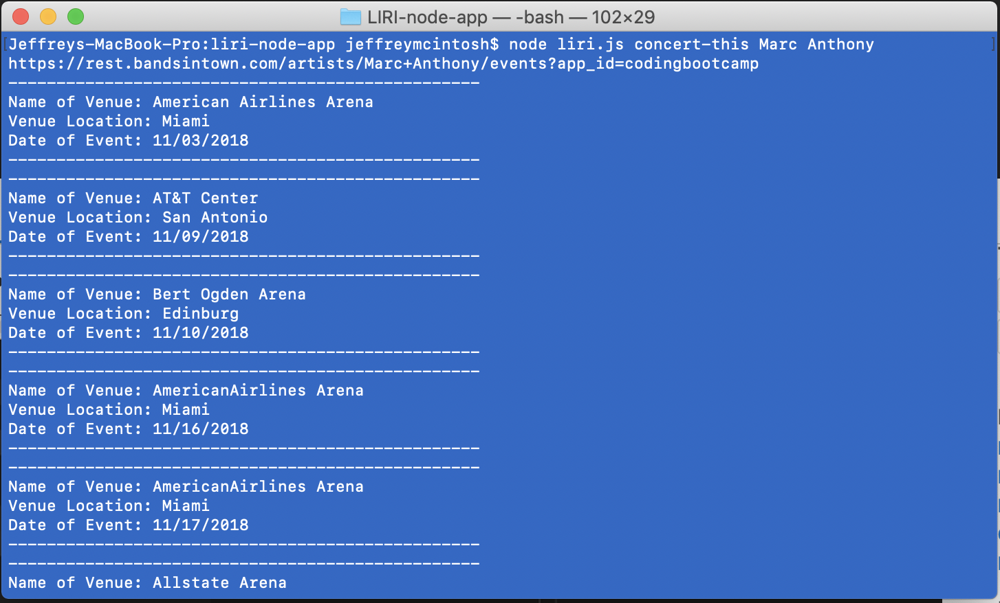
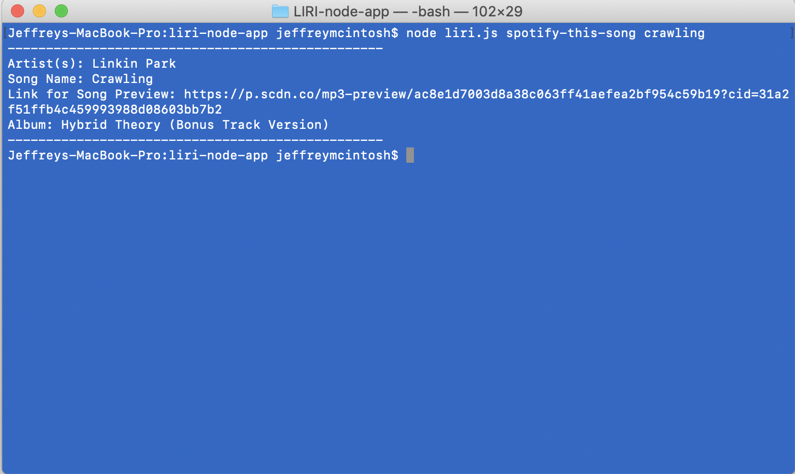
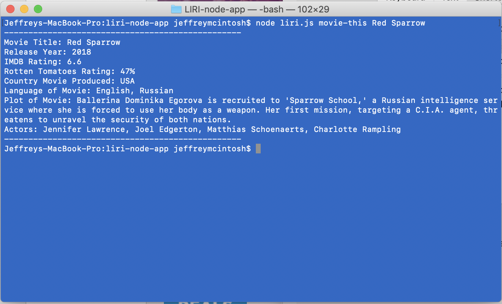
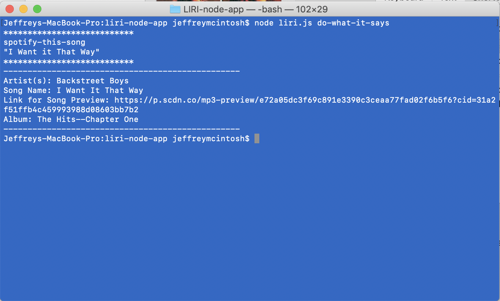

# LIRI Node App

Overview
LIRI is like iPhone's SIRI. However, while SIRI is a Speech Interpretation and Recognition Interface, LIRI is a Language Interpretation and Recognition Interface. LIRI is a command line node app that takes in parameters and gives you back data.

## LIRI Commands

### node liri.js concert-this

###node liri.js spotify-this-song

###node liri.js movie-this

###node liri.js do-what-it-says

